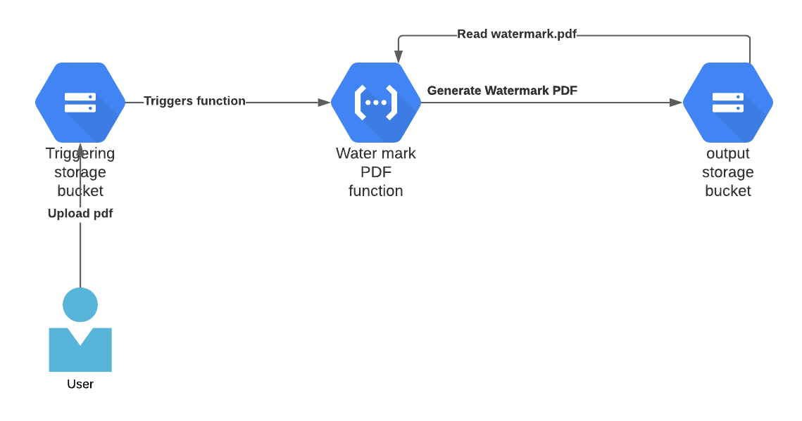

[](https://github.com/romeelk/watermark-cloud-function/actions/workflows/ci-build.yml)

[](https://github.com/romeelk/watermark-cloud-function/actions/workflows/codeql-scan.yml)

# Introduction

A Python cloud function that watermarks an uploaded pdf to cloud storage. It does this using a Python library 
which merges one pdf with the watermark with the source pdf.

## Pre-requesites

To use this repo you will require:
* Python 3
* gcloud cli
* GCP project
* Cloud function

# Architecture



There are two cloud storage buckets:

1) input storage bucket. This is the Cloud function trigger bucket. Upload the file to watermark. 
2) output storage bucket. Where the watermark pdf exists and where the final merged pdf is generated.

## creating a cloud function from gcloud

Before you create a gcloud function in GCP make sure you have created a GCP project.
To set the current project to deploy to use the following command:

```
gcloud projects list
```
To set your desired project run the command:

```
gcloud config set project project-name
```

## Deploying the sample function

To deploy the function run the following gcloud function from the folder where the function resides:

In this repo change 
```
cd src/function
gcloud functions deploy watermark_file \
--runtime python39 --trigger-bucket=storagebucket 
--set-env-vars WATERMARK_OUTPUT_BUCKET_NAME=storageoutputbucket
```

Where storagebucket is the bucket triggering the function and storageoutputbucket is the bucket where the watermarked pdf will be written to.

## Uploading a file to test trigger

The Python package watermarks the uploaded pdf by merging it with a file called watermark.pdf

1) Upload watermark.pdf to the output cloud storage bucket
2) Upload a pdf to watermark to the input storage cucket

To test trigger upload a pdf file from this repo:

```
gsutil cp watermark.pdf gs://outputbucket
gsutil cp input.pdf  gs://inputstoragebucket

```

## Monitor the cloud function

You can watch the trace logs in the GCP portal by navigating to the log tab in the function.